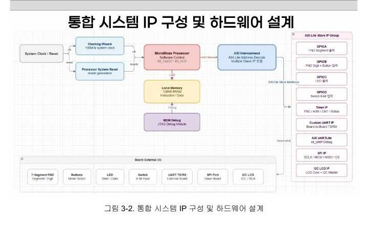
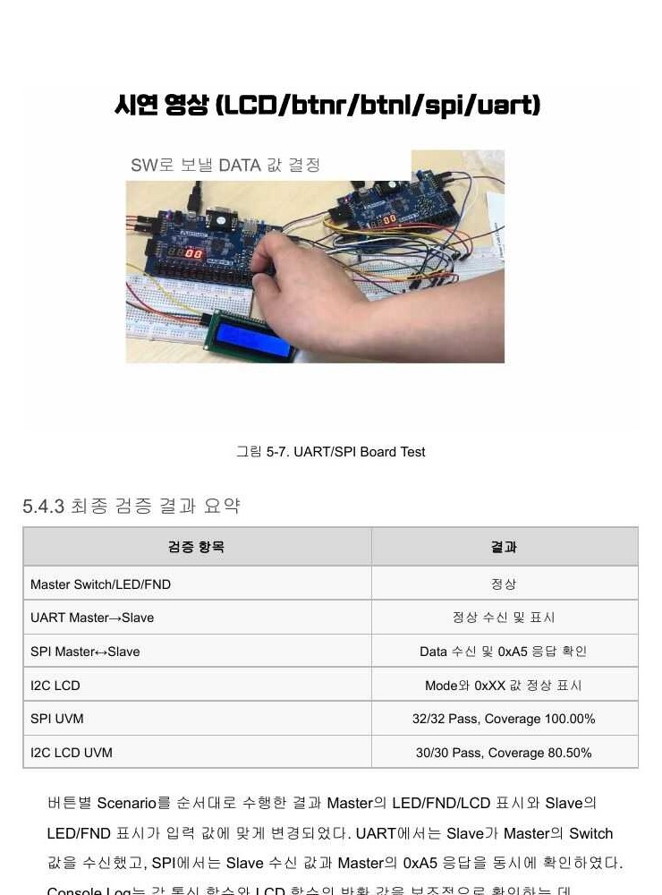

# MicroBlaze AXI4-Lite Peripheral System

MicroBlaze가 AXI4-Lite MMIO로 5개의 Custom Peripheral IP를 제어하고, 두 대의 Basys3가 UART와 SPI로 데이터를 교환하도록 구성한 FPGA HW/SW 통합 프로젝트입니다. Master 보드에는 Processor·Custom IP·Vitis C를, Slave 보드에는 순수 SystemVerilog UART RX·SPI Slave RTL을 적용했습니다.

> 개인 프로젝트 · 2026.06.22 - 2026.06.30 · Verilog/SystemVerilog · UVM · Vitis C · Vivado 2020.2

## Architecture



MicroBlaze는 AXI Interconnect를 통해 각 Peripheral의 Register Map에 접근합니다. Switch와 Button 입력을 Vitis 애플리케이션이 해석하고, Custom UART·SPI·I2C LCD IP가 실제 Protocol 신호를 생성합니다.

| Block | Role |
|---|---|
| Master Basys3 | MicroBlaze, BRAM, AXI Interconnect, Custom IP, Vitis C 제어 |
| Slave Basys3 | SystemVerilog UART RX, SPI Mode 0 Slave, LED/FND 출력 |
| Board-to-Board UART | Master의 8-bit Switch 값을 Slave LED/FND에 전송 |
| Board-to-Board SPI | MOSI로 Switch 값을 전송하고 MISO로 `0xA5` 응답 수신 |
| I2C LCD | 선택 모드와 `DATA/CNT 0xXX` 형식의 값을 표시 |

## Custom IP

| IP | AXI4-Lite Control | Main Function |
|---|---|---|
| GPIO | Data register read/write | Switch, Button, LED, FND 입출력 |
| Timer | Control/status register | AXI Timer register interface |
| Custom UART | TX data, start, status | 115200 bps UART 전송 |
| SPI | TX data, start, RX/status | Mode 0 SPI Master 통신 |
| I2C LCD | Mode/value, start, status | PCF8574 기반 Character LCD 제어 |

## Implemented Features

- Vivado Block Design 기반 MicroBlaze, BRAM, AXI Interconnect 및 Peripheral 통합
- `AW/W/B`, `AR/R` 채널 Handshake와 Byte Strobe를 처리하는 AXI4-Lite Slave Register 설계
- GPIO, Timer, UART, SPI, I2C LCD Custom IP RTL 및 Register Map 구성
- `Xil_In32`/`Xil_Out32` 기반 Vitis MMIO Driver와 통합 제어 애플리케이션
- 비동기 UART RX 입력의 2단 Synchronizer와 115200 bps, 8-N-1 수신 FSM
- SPI Mode 0의 Rising-edge Sampling, Falling-edge Update 및 MISO `0xA5` 응답
- Button edge detection, 50 ms debounce, timeout 및 통신 상태 표시
- Master/Slave 두 보드와 I2C LCD를 연결한 실제 FPGA 통합 시험

## Verification Summary

최종 프로젝트 보고서에 기록된 검증 결과입니다.

| Verification | Scoreboard | Functional Coverage | Note |
|---|---:|---:|---|
| SPI AXI UVM | 32/32 PASS | 100.00% | TXDATA, START, DONE 및 SPI complete 흐름 |
| I2C LCD UVM | 30/30 PASS | 80.50% | Address/data/ACK/complete 비교, 일부 Cross 조합 미수행 |
| FPGA Board Test | 정상 동작 확인 | - | UART, SPI, LCD, LED/FND 통합 시나리오 |



`verification/`에는 SPI AXI-Lite UVM 환경과 I2C Master/Slave UVM 환경을 분리했습니다. SPI 환경은 AXI-Lite Driver·Monitor·Scoreboard·Functional Coverage와 SPI Slave model을 포함합니다. 실행 방법과 지원 Test 이름은 각 디렉터리의 README에 정리했습니다.

## Debugging Highlights

- AXI UARTLite와 Custom UART의 B18 핀 충돌을 분리하고 Custom UART를 JB1/JB2로 이동
- IP Packaging에서 누락된 I2C LCD 하위 RTL을 Synthesis/Simulation File Group에 포함
- SPI MISO 1-bit shift 문제를 CS Falling preload와 Mode 0 edge 규칙으로 수정
- Button level 직접 사용으로 발생한 반복 동작을 rising-edge 검출과 debounce로 개선
- PCF8574 주소를 7-bit `0x27`, write address `0x4E`로 통일

## Source Structure

| Path | Description |
|---|---|
| `hardware/block_design/design_1.bd` | MicroBlaze 중심 Vivado Block Design |
| `hardware/ip/` | GPIO, Timer, UART, SPI, I2C LCD AXI4-Lite Custom IP |
| `hardware/rtl/slave_uart/` | Slave UART RX·SPI Slave·LED/FND SystemVerilog RTL |
| `hardware/constraints/` | Basys3 Master/Slave XDC |
| `software/common/` | MMIO HAL, 공통 Driver 및 Board I/O |
| `software/integrated_app/` | UART/SPI/LCD 통합 Vitis C 애플리케이션 |
| `software/uart_sender_app/` | UART 송신 단독 애플리케이션 |
| `software/uart_receiver_app/` | UART 수신 단독 애플리케이션 |
| `verification/spi_uvm/` | AXI-Lite 기반 SPI UVM 환경 |
| `verification/i2c_uvm/` | I2C Master/Slave UVM 환경 |

## Reproduction Notes and Limitations

- Vivado/Vitis에서 자동 생성되는 output products, bitstream, BSP, `xparameters.h`, linker script는 저장소에서 제외했습니다. `design_1.bd`로 Hardware Platform을 다시 생성해야 합니다.
- Custom IP를 Vivado IP Catalog에 package한 뒤 Block Design의 IP version과 address map을 확인해야 합니다.
- UVM Makefile은 Synopsys VCS와 UVM 1.2 환경을 기준으로 작성했습니다. 현재 저장소에는 원본 simulator log와 coverage database가 포함되지 않습니다.
- 보고서의 PASS/Coverage 수치는 제출 당시 실행 결과이며, 이 저장소만으로 CI에서 자동 재실행한 결과가 아닙니다.
- 최종 Vitis 데모의 BTNU Count-Up은 Timer IP의 CNT register가 아니라 software 변수 증가 방식입니다. Timer IP 실제 소프트웨어 연동은 후속 개선 항목입니다.
- 최종 보드 시연의 Custom UART는 Master 송신과 Slave 수신 경로만 사용합니다.

## Project Layout

```text
microblaze-axi4-lite-peripheral-system/
├── assets/
├── hardware/
│   ├── block_design/
│   ├── constraints/
│   ├── ip/
│   └── rtl/
├── software/
│   ├── common/
│   ├── integrated_app/
│   ├── uart_receiver_app/
│   └── uart_sender_app/
├── verification/
│   ├── i2c_uvm/
│   └── spi_uvm/
├── .gitignore
└── README.md
```
